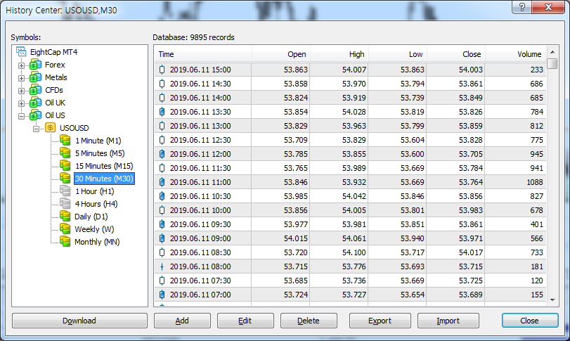

# Python 금융 데이터 다루는 예제 소스 파일들 #

Python pandas와 matplotlib를 이용해 주식, Forex 데이터를 분석하는 예제를 모아두었다.

### 실행 환경 ###
Anaconda 설치 환경에서 jupyter notebook 또는 qtconsole 상에서 예제를 수행한다.

* jupyter 실행 방법
Windows 시스템에서서는 "Anaconda Prompt"를 실행한다.
```bash
(base) C:\dataframe_meets_financial_data> jupyter notebook
```

### 예제 파일 ###
notebooks/MT4_tick_data_charting.ipynb
: MetaTrader 4 Export 분봉 데이터를 DataFrame으로 로드해서 차트그리는 예제

### 가격 데이터 구성 ###
금융 분봉 데이터는 "날짜 Datetime, 시가 Open, 고가 High, 저가 Low, 종가 Close, 거래량 Volume"으로 구성된다.  
MeterTrader4 분봉 데이터 Export 화면: 

---
  - by 알토란 - *Simple is better than complex*
